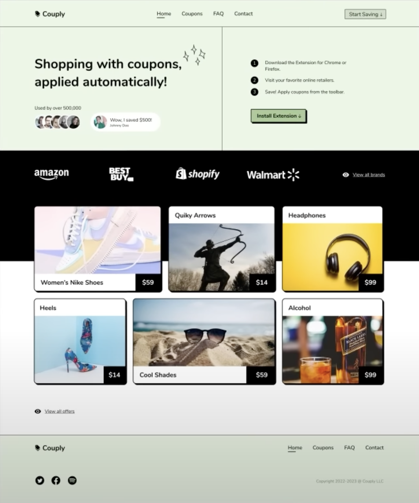

# Couplyweb practice

From Figma to responsive web design

# Redesigned version

Redesigned the initial version to be more spacious with the focus of having clear hierarchy

# Initial Figma Design

Initial design from Figma tutorial

